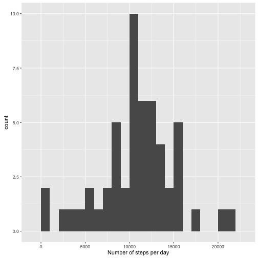
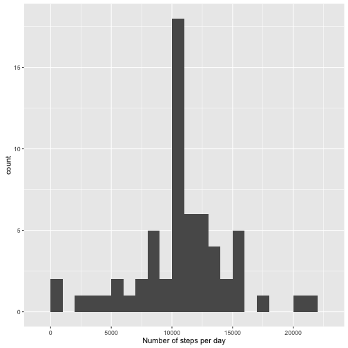
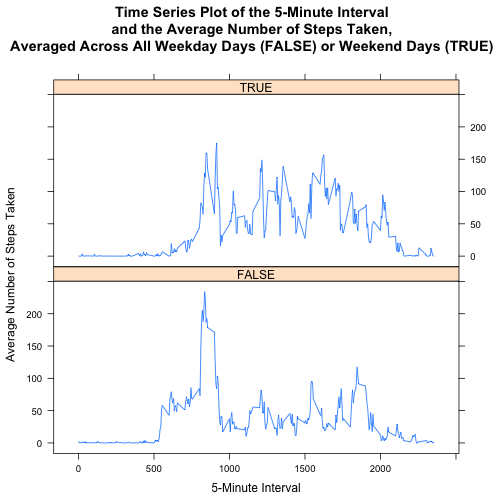

## Introduction
Introduction

It is now possible to collect a large amount of data about personal movement using activity monitoring devices such as a Fitbit, Nike Fuelband, or Jawbone Up. These type of devices are part of the \"quantified self\" movement\; a group of enthusiasts who take measurements about themselves regularly to improve their health, to find patterns in their behavior, or because they are tech geeks. But these data remain under-utilized both because the raw data are hard to obtain and there is a lack of statistical methods and software for processing and interpreting the data.

This assignment makes use of data from a personal activity monitoring device. This device collects data at 5 minute intervals through out the day. The data consists of two months of data from an anonymous individual collected during the months of October and November, 2012 and include the number of steps taken in 5 minute intervals each day.


## Loading and preprocessing the data
The data for this assignment can be downloaded from the course web site:

Dataset: <https://d396qusza40orc.cloudfront.net/repdata%2Fdata%2Factivity.zip>

Alternatively I forked the GitHub repo: <https://github.com/rdpeng/RepData_PeerAssessment1>, which contained the data as well. I will use the data from my forked repo: <https://github.com/PabloRoque/RepData_PeerAssessment1>.


```r
if (!file.exists("activity.zip")){
    url <- 'https://d396qusza40orc.cloudfront.net/repdata%2Fdata%2Factivity.zip'
    download.file(url, destfile = "activity.zip",method = "curl")
    unzip("activity.zip")
} else if (file.exists("activity.csv")) {
    print("Data folder exists, no need for unziping") # Check if data was unzip
    print("Data can be found in the activity.csv file")
} else {
    print("Data folder does not exist, unziping")
    print("Data can be found in the activity.csv file")
    unzip("activity.zip")
}
```

```
## [1] "Data folder exists, no need for unziping"
## [1] "Data can be found in the activity.csv file"
```

The variables included in this dataset are:

*    steps: Number of steps taking in a 5-minute interval (missing values are coded as \texttt{NA})
*    date: The date on which the measurement was taken in \texttt{YYYY-MM-DD} format
*    interval: Identifier for the 5-minute interval in which measurement was taken

The dataset is stored in a comma-separated-value (CSV) file and there are a total of 17,568 observations in this dataset.

Let's load the data and have a look at it:

```r
df <- read.csv('activity.csv')
head(df)
```

```
##   steps       date interval
## 1    NA 2012-10-01        0
## 2    NA 2012-10-01        5
## 3    NA 2012-10-01       10
## 4    NA 2012-10-01       15
## 5    NA 2012-10-01       20
## 6    NA 2012-10-01       25
```

Let's transform the date column to a date format, and the interval to hours-minutes. Note that the interval column is in the format, hm. This means it jumps from 50, 55, to 100.

```r
df$date <- as.Date(df$date, format ="%Y-%m-%d")
head(df)
```

```
##   steps       date interval
## 1    NA 2012-10-01        0
## 2    NA 2012-10-01        5
## 3    NA 2012-10-01       10
## 4    NA 2012-10-01       15
## 5    NA 2012-10-01       20
## 6    NA 2012-10-01       25
```
## __What is mean total number of steps taken per day?__
For this part of the assignment, we can ignore the missing values in the dataset.

1.    Calculate the total number of steps taken per day

```r
stepsDay <- aggregate(steps ~ date, data = df, sum, na.rm = TRUE)
head(stepsDay)
```

```
##         date steps
## 1 2012-10-02   126
## 2 2012-10-03 11352
## 3 2012-10-04 12116
## 4 2012-10-05 13294
## 5 2012-10-06 15420
## 6 2012-10-07 11015
```

2.    If you do not understand the difference between a histogram and a barplot, research the difference between them. Make a histogram of the total number of steps taken each day

```r
library(ggplot2)
qplot(stepsDay$steps, geom="histogram", binwidth = 1000, xlab = "Number of steps per day")
```



3.    Calculate and report the mean and median of the total number of steps taken per day


```r
mean(stepsDay$steps)
```

```
## [1] 10766.19
```

```r
median(stepsDay$steps)
```

```
## [1] 10765
```

## __What is the average daily activity pattern?__
1.    Make a time series plot (i.e. type = "l") of the 5-minute interval (x-axis) and the average number of steps taken, averaged across all days (y-axis)


```r
library(dplyr)
```

```
## 
## Attaching package: 'dplyr'
```

```
## The following objects are masked from 'package:stats':
## 
##     filter, lag
```

```
## The following objects are masked from 'package:base':
## 
##     intersect, setdiff, setequal, union
```

```r
library(ggplot2)
stepsInterval <- aggregate(steps ~ interval, data = df, mean, na.rm = TRUE)
p <- ggplot(stepsInterval, aes(x = interval, y = steps)) + geom_line()
p
```


2.    Which 5-minute interval, on average across all the days in the dataset, contains the maximum number of steps?


```r
indx <- which(stepsInterval$steps == max(stepsInterval$steps))
stepsInterval$interval[indx]
```

```
## [1] 835
```
## Imputing missing values

Note that there are a number of days/intervals where there are missing values (coded as NA). The presence of missing days may introduce bias into some calculations or summaries of the data.

1.    Calculate and report the total number of missing values in the dataset (i.e. the total number of rows with NAs)

```r
sum(is.na(df$steps))
```

```
## [1] 2304
```

2.    Devise a strategy for filling in all of the missing values in the dataset. The strategy does not need to be sophisticated. For example, you could use the mean/median for that day, or the mean for that 5-minute interval, etc.

I will use the mean for the 5-minute interval to populate NA values for a given interval.

3.    Create a new dataset that is equal to the original dataset but with the missing data filled in.

```r
newdf <- merge(df, stepsInterval, by = 'interval', all.y = F)
## merge NA values with averages rounding up for integers
newdf$steps.x[is.na(newdf$steps.x)] <- as.integer(round(newdf$steps.y[is.na(newdf$steps.x)]))
names(newdf) <- c('interval', 'steps', 'date', 'mean_steps')
newdf <- subset(newdf, select = c("steps", "date", "interval"))
newdf <- newdf[order(newdf$date, newdf$interval),]
```

4.    Make a histogram of the total number of steps taken each day and Calculate and report the mean and median total number of steps taken per day. 


```r
library(ggplot2)
newStepsDay <- aggregate(steps ~ date, data = newdf, sum)
qplot(newStepsDay$steps, geom="histogram", binwidth = 1000, xlab = "Number of steps per day")
```



```r
mean(newStepsDay$steps)
```

```
## [1] 10765.64
```

```r
median(newStepsDay$steps)
```

```
## [1] 10762
```

Do these values differ from the estimates from the first part of the assignment? What is the impact of imputing missing data on the estimates of the total daily number of steps?

They differ although not much:

Mean stepsDay $1.0766189 &times; 10<sup>4</sup>$ to $1.0765639 &times; 10<sup>4</sup>$

Median stepsDay $10765$ to $10762$


## Are there differences in activity patterns between weekdays and weekends?

For this part the weekdays() function may be of some help here. Use the dataset with the filled-in missing values for this part.

1.    Create a new factor variable in the dataset with two levels -- "weekday" and "weekend" indicating whether a given date is a weekday or weekend day.


```r
df['weekend_day'] <- as.factor(weekdays(df$date) %in% c("Saturday", "Sunday"))
head(df)
```

```
##   steps       date interval weekend_day
## 1    NA 2012-10-01        0       FALSE
## 2    NA 2012-10-01        5       FALSE
## 3    NA 2012-10-01       10       FALSE
## 4    NA 2012-10-01       15       FALSE
## 5    NA 2012-10-01       20       FALSE
## 6    NA 2012-10-01       25       FALSE
```

2.    Make a panel plot containing a time series plot (i.e. type = "l") of the 5-minute interval (x-axis) and the average number of steps taken, averaged across all weekday days or weekend days (y-axis). The plot should look something like the following, which was created using __simulated data:__


```r
newInterval <- aggregate(steps ~ interval + weekend_day, df, mean)

library(lattice)
xyplot(steps ~ interval | weekend_day,
        newInterval,
        type = "l",
        layout = c(1,2),
        main = "Time Series Plot of the 5-Minute Interval\nand the Average Number of Steps Taken,\nAveraged Across All Weekday Days (FALSE) or Weekend Days (TRUE)",
        xlab = "5-Minute Interval",
        ylab = "Average Number of Steps Taken"
)
```


